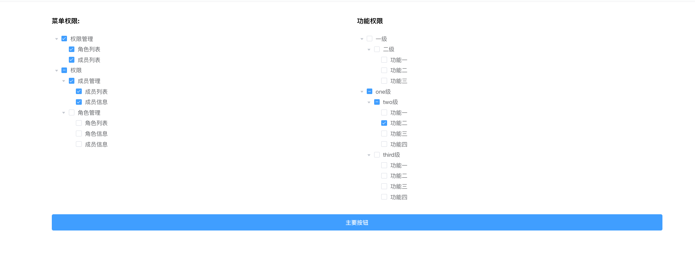

# 介绍
  基于 vue-element-admin 简单改造的管理系统的前端部分
  
  
  
# 修改点


## 登录

  登录这块基本上使用 vue-element-admin 本身的设计思想，用户登录验证成功之后，后台使用 jwt (JSON Web Token)，生成 token 返回，在之后的每次请求中，请求的 header 中会携带 token 信息，由后台进行校验
  
  
  


## 权限部分

1. 配置信息放到后台的配置文件，通过接口返回给权限编辑页面，并且将数据解析为 element tree 所需要的数据结构
  
   * 后台配置格式
     ```
       'actionTree' => [ // 控制功能按钮的权限
       		'一级,二级,功能一',
       		'一级,二级,功能二',
       		'一级,二级,功能三',
       		'one级,two级,功能一',
       		'one级,two级,功能二',
       		'one级,two级,功能三',
       		'one级,two级,功能四',
       		'one级,third级,功能一',
       		'one级,third级,功能二',
       		'one级,third级,功能三',
       		'one级,third级,功能四',
       	],
       	'menuTree'=>[  // 控制菜单展示
       		'权限管理,角色列表',
       		'权限管理,成员列表',
       		'权限,成员管理,成员列表',
       		'权限,成员管理,成员信息',
       		'权限,角色管理,角色列表',
       		'权限,角色管理,角色信息',
       		'权限,角色管理,成员信息',
       	],
     ```
   * 权限页面展示
    


2. 路由权限设置部分
    


3. 改进方向
    可以将权限配置保存在数据库，给前端提供接口，权限完全有前端进行控制，
    
    
    

## 基础功能介绍

1. 角色管理，包括新增、编辑

2. 针对角色的权限设置

3. 用户管理列表，包括新增，编辑功能，用户基本字段：邮箱、名称、状态、角色。支持多角色设置

4. 个人信息编辑，支持查看、修改头像、修改密码  


# 部署

* 通过 git 下载源码

* 执行安装程序 npm install

* 配置好后端地址 env.* 对应的文件

* 编译打包 npm run build:prod

* 设置 web 服务器，指向打包后的 dist/index.html
```$xslt
server {
    listen       80;
    server_name font.vueelement.com;
    root '/path/dist';
    location / {
       try_files $uri $uri/ /index.html;
    }
}
```